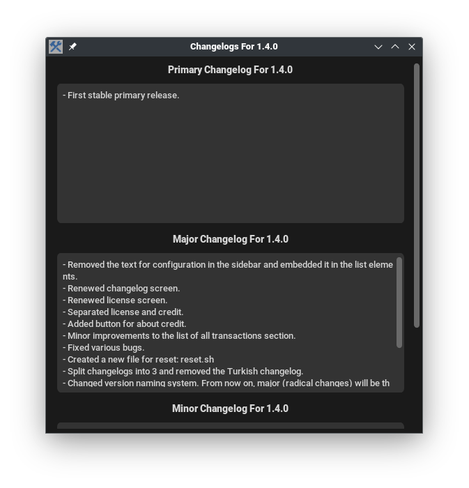
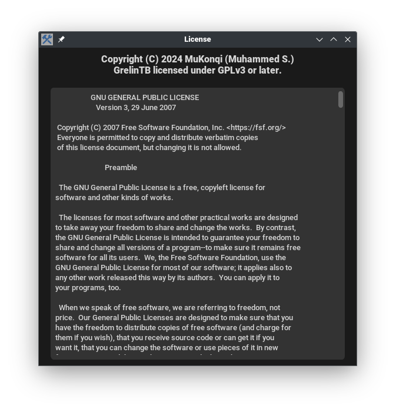
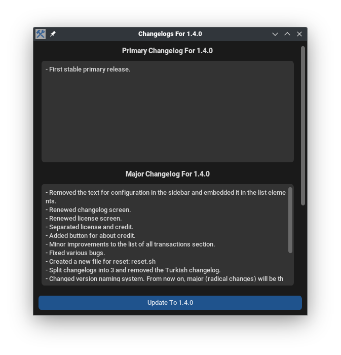
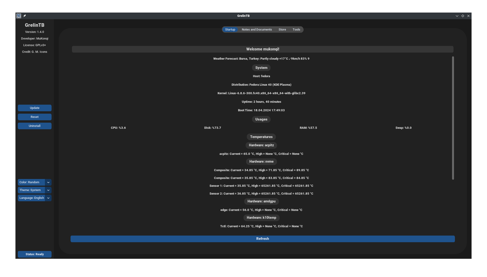

<p align="center"><a href="https://github.com/mukonqi/grelintb/releases"></img></a></p>
<p align="center"><a href="https://github.com/mukonqi/grelintb/releases"></img></a></p>
<p align="center"><a href="https://github.com/mukonqi/grelintb/releases"></img></a></p>
<p align="center"><a href="https://github.com/mukonqi/grelintb/releases"></a></p>

## Features
### Sidebar
- A button with hidden style for showing application's name for opening this repository.
- A button with hidden style for showing version for opening current version's changelog.
- A button with hidden style for opening [developer's website](https://mukonqi.github.io).
- A button with hidden style for opening a window which showing license.
- A button with hidden style for opening a window which showing credit.
- A button for controling updates. If new version available, get the changelog of the new version and update to new version.
- A button for resetting GrelinTB.
- A button for uninstalling GrelinTB.
- A list for changing color theme (random, dark blue, blue, green).
- A list for Changing appearance mode (system, light, dark).
- A list for Changing language (English, Turkish).
- A button for showing status. If some processes are working, it opens a new window for displaying all processes with time if not it shows a warning message.
### Startup
- Showing warious informations (weather forecast, system, usages, fans, tempatures, battery).
- Refreshing these informations.
### Notes and Documents
- Creating, editing, renaming, deleting notes or any documents.
### Store
- Traditional Applications: Searching, installing, reinstalling, uninstalling and updating predefined and desired applications.
- Flatpak Applications: Searching, installing, reinstalling, uninstalling and updating desired applications.
- Desktop Environments and Window Managers: Installing, reinstalling, uninstalling and updating some desktop environemtns and window managers.
- Traditional Scripts: Updating all packages, making more complex updates, clearing package cache, removing unnecessary packages, fixing broken dependencies, showing history and listing installed packages.
- Flatpak Scripts: Updating all packages, removing unnecessary packages, repairing Flatpak installation, showing history and listing installed packages.
- Systemd Services: Getting the status of any service or enabling, disabling, starting and stopping it.
### Tools
- Configuring Bash and Zsh.
- Changing the name of the computer.
- Showing some informations about some distributions.
- Making simple math operations (basic calculator).
### Also
- GrelinTB can auto detect tr_TR locale when there is no config related with language setting. If locale tr_TR, set GrelinTB's language Turkish. If not set GrelinTB's language English.
- GrelinTB can synchronize with the system theme (dark or light) when appearance setted to system.
- Check GrelinTB updates every Monday.
- Some parameters for terminal. Tip: Help page for all parameters: `grelintb help`
## Installation
<p align="center"><a href="https://github.com/mukonqi/grelintb/releases/latest/download/grelintb.rpm"></a></p>

- Warning: Install the following, although they usually come already installed: wget, sudo
- For Fedora Linux based distributions, install the RPM package at the top with clicking to it or type the following into the terminal: ```wget https://github.com/mukonqi/grelintb/releases/latest/download/grelintb.rpm ; sudo dnf install grelintb.rpm -y ; rm grelintb.rpm```
- For Debian GNU/Linux, Solus and Arch Linux based distributions, type the following into the terminal: 
```wget https://raw.githubusercontent.com/MuKonqi/grelintb/main/install-grelintb.sh ; chmod +x install-grelintb.sh ; sudo ./install-grelintb.sh ; rm install-grelintb.sh```
## GrelinTB vs MetterXP
- GrelinTB's UI is good and simpler. MetterXP has very bad UI and it is buggy.
- GrelinTB's window's size isn't fixed, it can flow any value bigger than 960x540.
- GrelinTB doesn't have so many themes but it has light and dark mode with 3 theme option.
- GrelinTB can detect system theme and tr_TR locale.
- GrelinTB supports Arch Linux based distributions but MetterXP doesn't.
- GrelinTB provides a RPM file.
- GrelinTB's codes are really more optimize because it is coded from scratch with object oriented programming. MetterXP wasn't coded from scratch so it has very remnats because it is based on BetterXP and BetterXP based on Terminalden kurtulun.
## Gallery







.png)
.png)


## Stars
- Let's give a ⭐ (star) to GrelinTB!

[](https://star-history.com/#mukonqi/grelintb&Date)
## Copyright Notification, License, Credit
- Copyright &copy; 2024 MuKonqi (Muhammed S.)
- GNU General Public License, Version 3.0 or later
- [Google Material Symbols](https://fonts.google.com/icons?selected=Material%20Symbols%20Outlined%3Aconstruction%3AFILL%400%3Bwght%40700%3BGRAD%40200%3Bopsz%4048) (for application icon)
